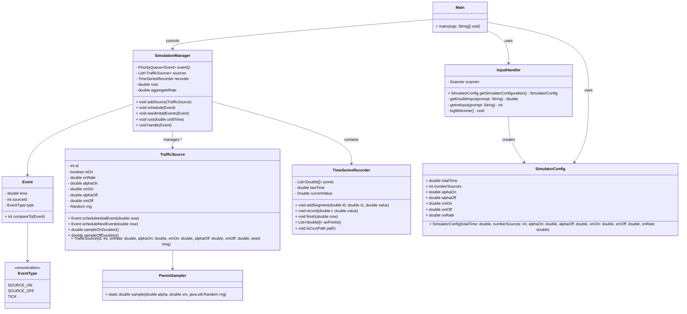

# Telecom-Network-Traffic-Simulator Class Diagram




# Sprint 1 — Design Review

## 1) Core Class Structure

### `TrafficSource`
**Responsibilities**
- Maintain ON/OFF state and schedule its own next state change events.
- Emit instantaneous rate contribution when ON (e.g., 1 unit per source; can be parameterised).
- Provide `scheduleInitialEvents()` and `scheduleNextEvent()` used by the simulation manager.

**Key Fields**
- `id: int`
- `isOn: boolean`
- `rngSeed: long` (optional for reproducibility)
- `paretoShape: double (alpha)` and `paretoScale: double (xm)`
- `onRate: double` (rate when ON)

**Key Methods**
- `boolean isOn()`
- `double sampleOnDuration()` and `double sampleOffDuration()` (via `ParetoSampler`)
- `Event scheduleInitialEvent(double now)`
- `Event scheduleNextEvent(double now)` — toggles state and returns the next event time

### `Event`
**Responsibilities**
- Immutable description of something that happens at a simulation time.
- Comparable by `time` to support a priority queue.

**Fields**
- `time: double`
- `type: EventType` (e.g., `SOURCE_ON`, `SOURCE_OFF`, `TICK`)
- `sourceId: int` (nullable for global events)

**Methods**
- Accessors and `compareTo` by `time` (ascending).

### `SimulationManager`
**Responsibilities**
- Own the global event queue and the main loop.
- Advance simulation time by popping the next event.
- Update aggregate rate and record time series.
- Ask sources to generate their next events when they toggle.

**Key Fields**
- `PriorityQueue<Event> eventQ`
- `List<TrafficSource> sources`
- `double now`
- `double aggregateRate`
- `TimeSeriesRecorder recorder`

**Key Methods**
- `void addSource(TrafficSource s)`
- `void schedule(Event e)`
- `void run(double untilTime)`  — main loop
- `void handle(Event e)` — update states and schedule follow‑ups

---

## 2) Event‑Driven Mechanism

**Event Queue Choice:** `PriorityQueue<Event>` from Java Collections, ordered by ascending `time`.
**Why:** O(log n) insertion and removal; natural fit for “next event wins” semantics in discrete‑event simulation.
**Main Loop (pseudo‑code):**
```
now = 0
seed initial events (from each TrafficSource)
while (!eventQ.isEmpty() && now < untilTime) {
    Event e = eventQ.poll();
    if (e.time > untilTime) break;
    // integrate aggregate over [now, e.time] if needed
    recorder.addSegment(now, e.time, aggregateRate);
    now = e.time;
    handle(e); // update source state, aggregate, schedule next events
}
recorder.finish(now);
```

---

## 3) Statistical Model — Heavy‑Tailed ON/OFF (Pareto)

**Method:** Inverse transform sampling using standard `java.util.Random` (or `SplittableRandom`).
Pareto with shape `alpha > 1` and scale `xm > 0` has CDF: `F(x) = 1 - (xm / x)^alpha` for `x >= xm`.
So: `U ~ Uniform(0,1)`, sample `X = xm / pow(1 - U, 1/alpha)`.
Implementation wrapped in `ParetoSampler.sample(alpha, xm, rng)`.

**Notes**
- Choose separate `(alpha_on, xm_on)` and `(alpha_off, xm_off)` if needed.
- For reproducibility, pass a seed per `TrafficSource` or a global seeded RNG.

---

## 4) State Management & Data Aggregation

**State:** Each `TrafficSource` holds its own `isOn` boolean. The `SimulationManager` maintains `aggregateOnCount` or `aggregateRate`.
**Efficient Aggregation:** Since changes only occur at event times, we update the aggregate *only when events fire* (O(1) per event) and record piecewise‑constant segments in `TimeSeriesRecorder`.
**Responsibility for output:** `TimeSeriesRecorder` stores `(time, value)` samples and can export CSV for plotting.

---
